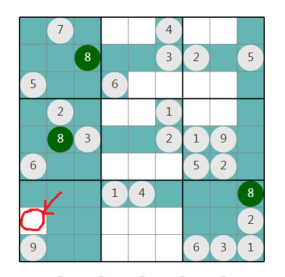
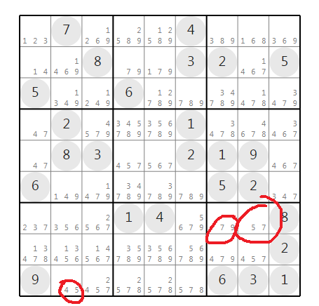

## Introduction
An interface to aid in solving Sudoku by providing visual cues and possible choices. The motivation behind the project was to understand how would the game play differ on paper vs an interactive interface.

## How to open
Download the repository and open the index.html file from the 'html' folder

## Features

### Highlighting Cells
The Highlight option helps visualize in which cells a number can and can't go. So if have a row/column/square in which only one cell is free, that would indicate that the particular value would go in that cell. Such a cell gets highlighted in the current version.

*The marked cell shows that 8 is possible in only one cell of that row, hence 8 should go there.This won't happen always as shown in other squares where there are more than 1 empty cells for any given row, column or square.*

---

### Showing Possible Values
The Possible Values option shows the constraints that the other numbers on the board put on any cell.

*The marked cells can only have 2 values based on the constraints set by other numbers in the same row, column and square.*
